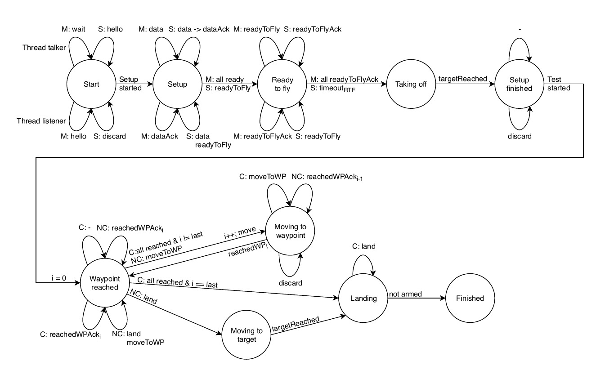
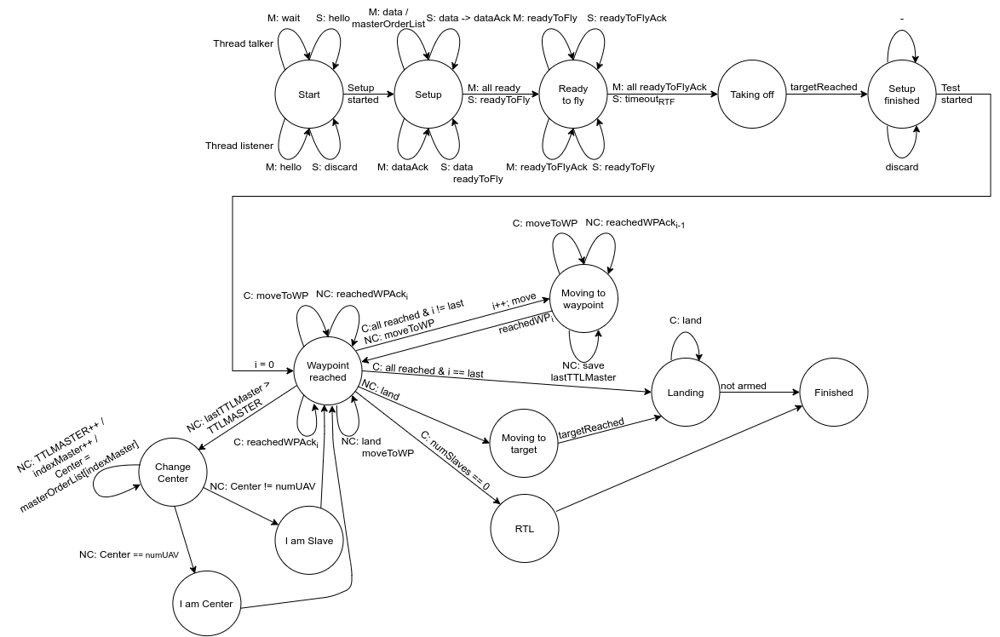

# ArduSim MUSCOP Protocol extension

## Authors

* Manel Lurbe Sempere (malursem@inf.upv.es)
* Izan Catalán Gallach (izcagal@inf.upv.es)

# Documentation

- [Documentation of the extension.](https://github.com/mlurbe97/ArduSim-MUSCOP-Protocol-SRM/blob/master/doc/MUSCOP_extension.pdf)

- [Publication conference in 2020 29th International Conference on Computer Communications and Networks (ICCCN)](https://ieeexplore.ieee.org/document/9209634)

## Development and testing

Replace *muscop* package of this repo in ardusim official *muscop* package (if the official repo doesn't contains the extension):

ArduSim Git:
https://bitbucket.org/frafabco/ardusim/src/master/

Folder *ardusimMisions* contains the mission used to test this project and the velocity *.csv* file necessary to run this demo.

You can also watch a demo in Youtube [Go to video](https://www.youtube.com/watch?v=RGRlsm1MN9c)

## Abstract

MUSCOP is a drone control protocol based on Slaves UAVs that follows a Master UAV (Center) in the course of an air mission. The current problem with this protocol is that if the master drone fails, the other drones do not finish the mission. Our proposal consists of an extension of this protocol to tolerate failures in the master drone, in order to permit the remaining drones to complete the mission.

- MUSCOP original diagram.

- MUSCOP extension diagram.

